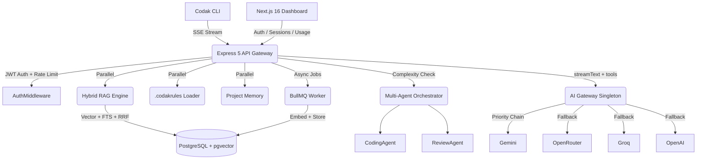

<div align="center">
  
  <h1 align="center">Codak AI</h1>
  <p align="center"><strong>Production-Grade, Rules-First Autonomous AI Software Engineer</strong></p>

  <p align="center">
    <a href="https://bun.sh"></a>
    <a href="https://nextjs.org/"></a>
    <a href="https://react.dev/"></a>
    <a href="https://www.typescriptlang.org/"></a>
    <a href="https://tailwindcss.com/"></a>
    <a href="https://www.postgresql.org/"></a>
    <a href="https://vitest.dev/"></a>
  </p>
</div>

<br />

Codak AI is an advanced, terminal-native autonomous coding agent engineered to solve the most critical flaw in modern AI coding assistants: **context ignorance**.

Unlike standard chat interfaces that generate generic, hallucinated boilerplate, Codak integrates deeply into your local environment. It uses a **Hybrid RAG pipeline** with Reciprocal Rank Fusion (RRF), enforces strict architectural constraints via `.codakrules`, features **multi-agent orchestration** (Orchestrator → CodingAgent → ReviewAgent), and a resilient **AI Gateway** with circuit breakers and multi-provider fallback chains.

---

## 🎯 The Problem vs. The Codak Solution

| Traditional AI Assistants | Codak AI |
| :--- | :--- |
| Generate generic, isolated code snippets. | **Context-Aware:** Hybrid RAG (vector + full-text + RRF fusion) grounded in your actual codebase. |
| Violate project architecture and styling rules. | **Rules-First:** Strictly obeys `.codakrules` (e.g., "Always use App Router", "Never use raw CSS"). |
| Require manual copy-pasting and context feeding. | **Autonomous:** Lives in your terminal. Directly modifies files. |
| Fail silently when their code throws type errors. | **Self-Healing:** Runs your build commands, parses `stderr`, and fixes its own mistakes. |
| Single AI provider dependency. | **Resilient Gateway:** Multi-provider fallback with circuit breakers (auto-recovery after 5 min). |
| No memory across sessions. | **Project Memory:** Persists intent, package manager, and architectural context across sessions. |

---

## 🏗️ System Architecture

Codak is an enterprise-ready Monorepo using **Bun Workspaces** with 5 packages:

```
codak-cli-ai/
├── packages/
│   ├── cli/        → Ink-based terminal UI (React + Yoga)
│   ├── server/     → Express 5 API + BullMQ workers
│   ├── web/        → Next.js 16 dashboard
│   ├── database/   → Prisma 7 + pgvector schema
│   └── shared/     → Tool definitions + model registry
```

### High-Level Request Flow



---

## ⚙️ Tech Stack

| Layer | Technology |
|---|---|
| **Runtime & Monorepo** | Bun 1.3+ with Bun Workspaces |
| **Backend API** | Express 5.2.1 + Server-Sent Events (SSE) for real-time streaming |
| **AI Orchestration** | Vercel AI SDK (`streamText`, `generateText`, `tool`) |
| **LLM Providers** | Gemini → OpenRouter → Groq → OpenAI (priority fallback chain) |
| **Embedding Providers** | Voyage AI (`voyage-code-3`, 1024-dim) → Jina → Cohere → HuggingFace → Gemini |
| **Background Jobs** | BullMQ 5.x — 3 retry attempts, exponential backoff (5s delay) |
| **Database ORM** | Prisma 7.8.0 with Neon Serverless PostgreSQL |
| **Vector Search** | `pgvector` — cosine similarity on 1024-dimensional embeddings |
| **Caching & State** | Redis / ioredis (Upstash) for sessions, rate limiting, embedding cache |
| **Terminal UI** | Ink (React for terminal) + Yoga layout engine |
| **Web Dashboard** | Next.js 16.2.7 (App Router), React 19, Tailwind CSS v4 |
| **Security** | Helmet 8, express-rate-limit, JWT + bcrypt, secure refresh token rotation |
| **Payments** | Razorpay (Free / Pro / Enterprise subscription tiers) |
| **Testing & QA** | Vitest integration suites + Husky pre-commit hooks |

---

## ✨ Core Engineering Features

### 1. 🔍 Hybrid RAG — Reciprocal Rank Fusion (RRF)

Codak indexes your codebase with a sliding-window chunker (150 lines/chunk, 20-line overlap). On each query it executes a **hybrid search** combining:

- **Vector similarity search** — semantic understanding via pgvector (`<->` cosine distance)
- **Full-text keyword search** — exact symbol matching via PostgreSQL `tsvector` / `to_tsquery`
- **RRF Fusion** — `score = Σ 1/(60 + rank_i)` merges both result sets without score normalization

Supported languages: `.ts .tsx .js .jsx .py .go .rs .java .cpp .c .md .json .yaml .yml .toml`

### 2. 🛡️ Resilient AI Gateway (Singleton)

`AIGateway` is the single entrypoint for all AI operations, composing:

| Component | Responsibility |
|---|---|
| `ProviderRouter` | Routes requests across the fallback chain |
| `FallbackManager` | Priority-ordered provider list; skips unhealthy ones |
| `HealthManager` | Circuit breaker — marks providers unhealthy, auto-recovers after 5 min |
| `RetryManager` | Exponential backoff on transient errors |
| `CacheManager` | Redis-backed embedding cache + in-flight deduplication |
| `MetricsManager` | Structured JSON logs per request (latency, provider, tokens) |

**Embedding chain:** Voyage → Jina → Cohere → HuggingFace → Gemini  
**LLM chain:** Gemini → OpenRouter → Groq → OpenAI

### 3. 🤖 Multi-Agent Orchestration

For complex tasks (detected via keyword + word-count heuristics), Codak spawns a pipeline:

- **Orchestrator** — decomposes the request into typed tasks: `code | test | review | explain`
- **CodingAgent** — writes or modifies source files
- **ReviewAgent** — performs a quality gate review pass
- **Planner** — generates a structured, non-destructive plan in `@plan` mode

Simple tasks bypass orchestration entirely for minimum latency.

### 4. 📋 The `.codakrules` Engine

A `.codakrules` file in the project root defines immutable system constraints. Rules are cached and invalidated on file change, then dynamically injected into the system prompt at runtime — enforcing architectural consistency across every AI interaction.

### 5. 🧠 Project Memory

Codak maintains per-session memory in Redis, retaining:
- Package manager detected (`npm`, `bun`, `pnpm`, `yarn`)
- Key architectural decisions from past interactions
- User intent and stated constraints

This context is prepended to the system prompt on every subsequent message.

### 6. 🛠️ 14 Built-in Agent Tools

| Category | Tools |
|---|---|
| **File System** | `read_file`, `write_file`, `edit_file`, `list_files`, `create_directory`, `delete_file`, `search_files` |
| **Execution** | `run_command` |
| **Git** | `git_status`, `git_diff`, `git_commit`, `git_checkout`, `git_log`, `git_create_branch` |

### 7. ⚙️ Async Embedding Queue (BullMQ)

Codebase indexing is offloaded to a BullMQ worker with two job types:
- `indexCodebase` — full workspace scan (deduplicated per session via `jobId`)
- `reindexFile` — incremental single-file re-embedding on save

### 8. 💳 Subscription Tiers & Usage Tracking

Every interaction logs `promptTokens`, `completionTokens`, `totalTokens`, and optional `cost` to the `UsageToken` model. Tiers: **FREE**, **PRO**, **ENTERPRISE** backed by Razorpay payment integration.

### 9. 🔐 Security & Auth

- JWT access tokens (short-lived) + rotating refresh tokens with `selector:hash` split storage for O(1) lookup
- bcrypt password hashing + OAuth user support
- Token invalidation via Redis session cache
- Helmet 8 headers + express-rate-limit

### 10. 🧪 Automated Testing & Git Hooks

Every `git commit` triggers a Husky pre-commit hook that runs:
1. Monorepo-wide TypeScript static analysis (`tsc --noEmit`)
2. Vitest integration test suite (`packages/server`)

---

## 🗄️ Database Schema

```
User            — email, tier (FREE/PRO/ENTERPRISE), Razorpay IDs
 └── Session    — per-workspace context, cwd
      ├── Message        — chat history (role, mode, model, status)
      ├── CodeChunk      — vector(1024) embeddings via pgvector
      ├── ToolExecution  — audit log of every tool call + duration
      └── UsageToken     — token accounting per message (prompt/completion/total/cost)
 └── RefreshToken — selector+hash split for secure O(1) lookup
```

---

## 🚀 Getting Started

### Prerequisites
- [Bun](https://bun.sh) 1.3+
- PostgreSQL with `pgvector` extension enabled (Neon free tier is ideal)
- Redis server (Upstash free tier)
- API keys for at least one LLM provider and one embedding provider

### Installation & Setup

1. **Clone & Install**
   ```bash
   git clone https://github.com/yashutandon/codak-cli-ai.git
   cd codak-cli-ai
   bun install
   ```

2. **Environment Variables**

   Configure `.env` files in `packages/server`, `packages/cli`, and `packages/web`. Key variables:

   | Variable | Required | Description |
   |---|---|---|
   | `DATABASE_URL` | ✅ | Neon/PostgreSQL connection string |
   | `REDIS_URL` | ✅ | Upstash Redis URL |
   | `JWT_SECRET` | ✅ | Access token signing secret |
   | `JWT_REFRESH_SECRET` | ✅ | Refresh token signing secret |
   | `GOOGLE_GENERATIVE_AI_API_KEY` | ✅ | Gemini LLM + fallback embedding |
   | `VOYAGE_API_KEY` | Recommended | Primary embedding (`voyage-code-3`, 1024-dim) |
   | `OPENROUTER_API_KEY` | Optional | LLM fallback #2 |
   | `GROQ_API_KEY` | Optional | LLM fallback #3 |
   | `OPENAI_API_KEY` | Optional | LLM fallback #4 |
   | `JINA_API_KEY` | Optional | Embedding fallback #2 |
   | `COHERE_API_KEY` | Optional | Embedding fallback #3 |
   | `HF_API_KEY` | Optional | Embedding fallback #4 (HuggingFace) |
   | `RAZORPAY_KEY_ID` | Optional | Payment integration |
   | `RAZORPAY_KEY_SECRET` | Optional | Payment integration |

3. **Database Setup**
   ```bash
   # Enable pgvector extension first in your PostgreSQL instance:
   # CREATE EXTENSION IF NOT EXISTS vector;

   cd packages/database
   bunx prisma generate
   bunx prisma db push
   ```

4. **Launch the Monorepo**
   ```bash
   bun run dev:server   # Express API on :3001 + BullMQ worker
   bun run dev:web      # Next.js Dashboard on :3000
   bun run dev:cli      # Ink terminal UI
   ```

5. **Authenticate**
   ```bash
   codak login
   ```

---

## ⌨️ CLI Reference

| Command | Description |
|---------|-------------|
| `codak "<prompt>"` | Context-aware task execution in `@build` mode. |
| `codak "<prompt>" ./img.png` | Vision Mode: multimodal UI analysis (`.png`, `.jpg`, `.webp`). |
| `codak login` | Secure OAuth/Email login flow. |
| `codak logout` | Terminates session and clears stored tokens. |
| `codak whoami` | Shows authenticated user, subscription tier, and token usage. |
| `@plan` | Analyze and output a plan **without** executing file changes. |
| `@build` | Switch into full autonomous execution mode. |

---

## 🔌 API Routes (`/api/v1`)

| Method | Endpoint | Auth | Description |
|---|---|---|---|
| `GET` | `/health` | — | Health check |
| `POST` | `/auth/register` | — | Email/password registration |
| `POST` | `/auth/login` | — | Login → access + refresh tokens |
| `POST` | `/auth/refresh` | — | Rotate refresh token |
| `POST` | `/auth/logout` | — | Revoke refresh token |
| `GET/POST` | `/sessions` | JWT | List / create sessions |
| `POST` | `/sessions/:id/messages` | JWT | Send message (SSE stream) |
| `GET` | `/sessions/:id/messages` | JWT | Message history |
| `GET` | `/usage` | JWT | Token usage statistics |
| `POST` | `/payments` | — | Razorpay payment webhook |

---

## 🧱 Monorepo Scripts

```bash
bun run dev:server     # Express API + BullMQ worker (watch mode)
bun run dev:web        # Next.js dashboard (watch mode)
bun run dev:cli        # Ink terminal UI (watch mode)
bun run typecheck      # tsc --noEmit across server + web
bun run test           # Vitest integration suite (packages/server)
```

---

## 📄 License

This project is licensed under the MIT License — see the [LICENSE](LICENSE) file for details.