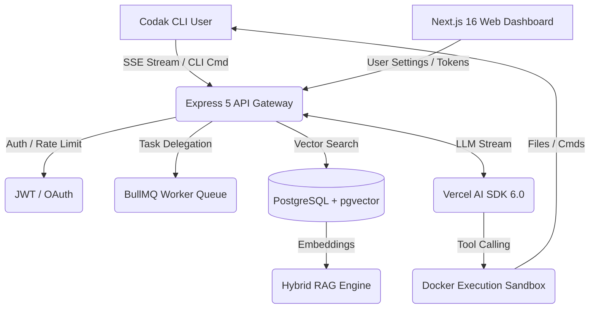

<div align="center">
  
  <h1 align="center">Codak AI</h1>
  <p align="center"><strong>Production-Grade, Rules-First Autonomous AI Software Engineer</strong></p>
  
  <p align="center">
    <a href="https://bun.sh"></a>
    <a href="https://nextjs.org/"></a>
    <a href="https://react.dev/"></a>
    <a href="https://www.typescriptlang.org/"></a>
    <a href="https://tailwindcss.com/"></a>
    <a href="https://www.postgresql.org/"></a>
    <a href="https://vitest.dev/"></a>
  </p>
</div>

<br />

Codak AI is an advanced, terminal-native autonomous coding agent engineered to solve the most critical flaw in modern AI coding assistants: **context ignorance**. 

Unlike standard chat interfaces that generate generic, hallucinated boilerplate, Codak integrates deeply into your local environment. It utilizes a **Hybrid Retrieval-Augmented Generation (RAG)** pipeline to dynamically fetch codebase context, enforces strict architectural constraints via `.codakrules`, and features a self-healing execution loop capable of autonomously resolving build errors.

---

## 🎯 The Problem vs. The Codak Solution

| Traditional AI Assistants | Codak AI |
| :--- | :--- |
| Generate generic, isolated code snippets. | **Context-Aware:** Analyzes your local workspace via Vector Similarity Search before writing a single line of code. |
| Violate project architecture and styling rules. | **Rules-First:** Strictly obeys `.codakrules` (e.g., "Always use App Router", "Never use raw CSS"). |
| Require manual copy-pasting and context feeding. | **Autonomous:** Lives in your terminal. Modifies files directly with explicit Y/N safety prompts. |
| Fail silently when their code throws type errors. | **Self-Healing:** Runs your build commands, parses `stderr`, identifies the root cause, and fixes its own mistakes. |
| Text-only limitations. | **Multimodal Vision:** Processes UI screenshots/mockups (`.png`, `.jpg`, `.webp`) and implements the required CSS/React code. |

---

## 🏗️ System Architecture & Engineering 

Codak is architected as a high-performance, enterprise-ready Monorepo utilizing **Bun Workspaces**.

### High-Level Flow


### ⚙️ The Tech Stack (Bleeding Edge)
- **Monorepo / Runtime:** Bun 1.3+ (Ultra-fast package management and execution)
- **Backend API:** Express 5.2.1, Server-Sent Events (SSE) for real-time LLM token streaming
- **AI Orchestration:** Vercel AI SDK 6.0 (`ai` package) with dynamic tool calling and multi-agent delegation (OpenAI, Anthropic, Google Gemini, Groq).
- **Background Jobs:** BullMQ 5.79 for robust, asynchronous task queuing and scheduled telemetry.
- **Database:** Prisma 7.8.0 interacting with a Neon Serverless PostgreSQL database.
- **Vector Database (RAG):** `pgvector` for executing rapid cosine similarity searches on 3072-dimensional embeddings (`gemini-embedding-001`).
- **Caching & State:** Redis / ioredis (Upstash) for session state, rate limiting, and BullMQ persistence.
- **Frontend / Dashboard:** Next.js 16.2.7 (App Router), React 19.2.4 (React Compiler enabled), and Tailwind CSS v4 for a highly optimized, client-side dynamic dashboard.
- **Security & QA:** Helmet 8, Express Rate Limit, JWT + bcrypt, Husky Git Hooks, and Vitest Integration suites.

---

## ✨ Core Engineering Features

### 1. Hybrid RAG Codebase Intelligence
Codak chunks your repository files (150-line segments with 20-line overlaps) and generates embeddings. When a prompt is received, Codak performs a semantic search against your codebase using `pgvector`. This ensures the LLM is grounded in your *actual* project structure, utilizing your existing utility functions and types.

### 2. The `.codakrules` Engine
By placing a `.codakrules` file in the repository root, developers define immutable system constraints. This is critical for enterprise environments where consistency is paramount. The backend dynamically merges these rules into the system prompt at runtime.

### 3. Isolated Docker Sandboxing
To ensure zero-trust execution, shell commands can be isolated. We execute the LLM's proposed bash commands inside a locked-down Docker container. Network access is disabled, and memory is strictly limited, neutralizing the risk of hallucinated destructive commands (`rm -rf`, `wget malicious_script`).

### 4. Multimodal Vision Pipeline
Codak bridges the gap between design and code. By providing an image path (e.g., `codak "Fix this alignment" ./bug.png`), the CLI converts the image to base64, streams it to the API, and utilizes multimodal LLMs (like GPT-4o or Claude 3.5 Sonnet) to visually analyze and correct UI layout issues.

### 5. Real-Time Token & Billing Telemetry
Every interaction tracks token usage dynamically. The API aggregates prompt/completion tokens and synchronizes them via BullMQ to the Postgres database, ensuring accurate billing logic and usage limit enforcement for different subscription tiers (Free, Pro, Enterprise).

### 6. Automated Testing & Git Hooks
Codak enforces strict code quality via Husky and Vitest. Every `git commit` triggers a robust `pre-commit` hook that executes monorepo-wide TypeScript static analysis (`tsc --noEmit`) and runs the backend integration test suite. This guarantees that broken code or API regressions are intercepted before entering version control.

---

## 🚀 Getting Started

### Prerequisites
- [Bun](https://bun.sh) 1.3+
- PostgreSQL with `pgvector` enabled (Neon free tier is ideal).
- Redis Server (Upstash free tier).
- API Keys for your preferred LLM provider.

### Installation & Setup

1. **Clone & Install**
   ```bash
   git clone https://github.com/yashutandon/codak-cli-ai.git
   cd codak-cli-ai
   bun install
   ```

2. **Environment Variables**  
   Configure your `.env` files in `packages/server`, `packages/cli`, and `packages/web` using the provided `.env.example` templates. Key variables include `DATABASE_URL`, `REDIS_URL`, `JWT_SECRET`, and `OPENAI_API_KEY`.

3. **Database Migration**
   ```bash
   cd packages/database
   bunx prisma generate
   bunx prisma db push
   ```

4. **Launch the Monorepo**
   ```bash
   # Starts the Express API (:3001), Next.js Dashboard (:3000), and the CLI
   bun run dev:server
   bun run dev:web
   bun run dev:cli
   ```

### Authentication
Codak utilizes a browser-callback OAuth flow. Run the following command in your terminal to securely authenticate without storing credentials locally:
```bash
codak login
```

---

## ⌨️ CLI Reference

| Command | Description |
|---------|-------------|
| `codak "<prompt>"` | Evaluates the codebase and executes the requested task. |
| `codak "<prompt>" ./img.png` | Vision Mode: Analyzes the image along with the prompt. |
| `codak login` | Initiates the secure OAuth/Email login flow. |
| `codak logout` | Terminates the active session and clears tokens. |
| `codak whoami` | Displays authenticated user, subscription tier, and token usage. |
| `@plan` | Terminal UI Shortcut: Analyzes the task and outputs a plan *without* execution. |
| `@build` | Terminal UI Shortcut: Swaps into full execution mode. |

---

## 📄 License
This project is licensed under the MIT License - see the [LICENSE](LICENSE) file for details.